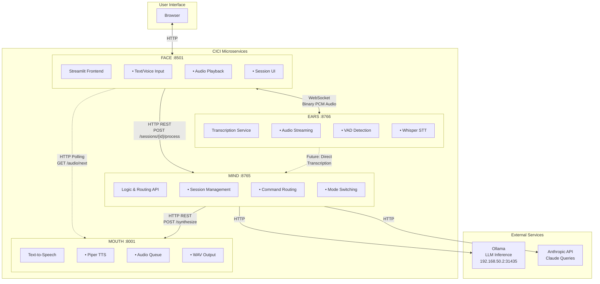
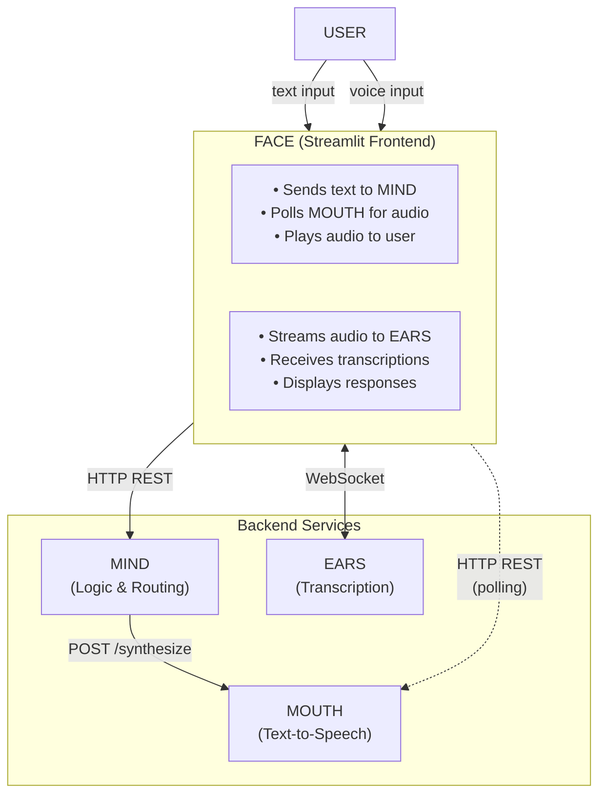
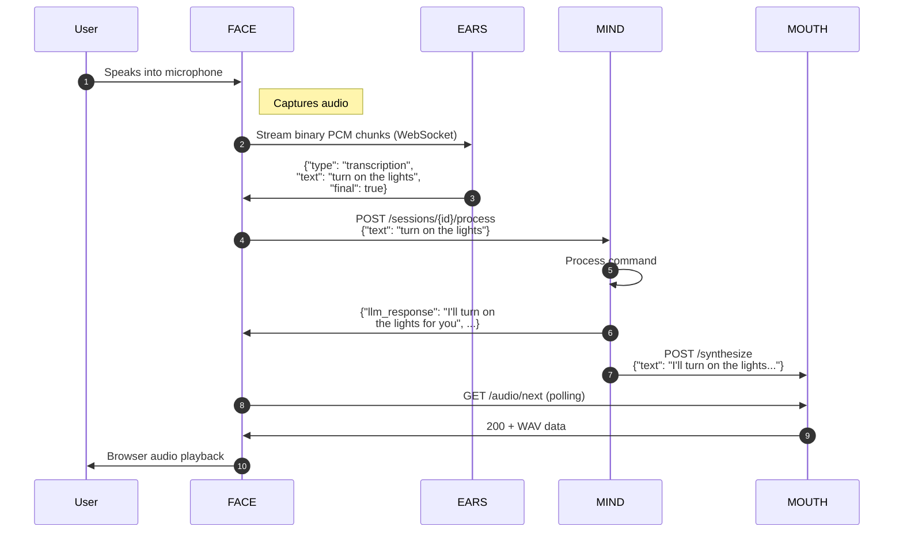

# cici - Voice and Text Personal Assistant

A microservices-based personal assistant with voice transcription, command routing, and a web UI.

## Architecture



### Data Flow

```mermaid
sequenceDiagram
    participant U as User
    participant F as FACE
    participant E as EARS
    participant M as MIND
    participant T as MOUTH
    participant O as Ollama/Claude

    rect rgb(40, 40, 60)
        Note over U,F: Voice Input Flow
        U->>F: Speak into microphone
        F->>E: Stream PCM audio (WebSocket)
        E->>F: {"type": "transcription", "text": "...", "final": true}
    end

    rect rgb(40, 60, 40)
        Note over F,O: Processing Flow
        F->>M: POST /sessions/{id}/process
        M->>O: LLM Query
        O->>M: Response
        M->>T: POST /synthesize
        M->>F: {"llm_response": "..."}
    end

    rect rgb(60, 40, 40)
        Note over F,T: Audio Output Flow
        F->>T: GET /audio/next (polling)
        T->>F: WAV audio data
        F->>U: Play audio
    end
```



## Components

| Component | Description | Port | NodePort | Protocol |
|-----------|-------------|------|----------|----------|
| **MIND** | Logic and routing service | 8765 | 30211 | HTTP REST |
| **EARS** | Audio transcription service | 8766 | 30212 | WebSocket |
| **MOUTH** | Text-to-speech service | 8001 | 30213 | HTTP REST |
| **FACE** | Streamlit frontend UI | 8501 | 30210 | HTTP |
| **FACE-Android** | Android mobile client | — | — | HTTP/WS |

### MIND - Logic & Routing

FastAPI service that handles:
- Session management (create, list, kill)
- Voice-to-CLI text translation
- Command routing (Ollama, CLI, Claude, Claude Code modes)
- Controller execution

See [`mind/README.md`](mind/README.md) for details.

### EARS - Transcription

WebSocket service for pure audio transcription:
- Streaming audio via WebSocket
- Voice Activity Detection (VAD)
- Whisper-based speech-to-text
- Raw transcription output (no business logic)

See [`ears/README.md`](ears/README.md) for details.

### FACE - Frontend

Streamlit-based web UI:
- Text input with voice-style syntax
- Session management
- Mode switching
- Command result display

See [`face/README.md`](face/README.md) for details.

### FACE-Android - Mobile Client

Native Android app (`face-android/`):
- Text and voice input with real-time transcription
- Connects to MIND (HTTP), EARS (WebSocket), MOUTH (HTTP polling)
- Configurable service endpoints via in-app settings
- Default endpoints: `192.168.50.2` with k8s NodePorts (30211/30212/30213)
- Android Auto stub for future car integration

See [`docs/android-users-manual.md`](docs/android-users-manual.md) for ADB testing guide.

### MOUTH - Text-to-Speech

FastAPI service for TTS synthesis:
- Piper TTS integration
- Queue-based audio generation
- WAV audio output (22050Hz)

See [`mouth/README.md`](mouth/README.md) for details.

## Quick Start

### 1. Start MIND (required)

```bash
cd mind
uv sync
uv run python -m mind.main
```

### 2. Start EARS (optional, for voice)

```bash
cd ears
uv sync
uv run python -m ears.main
```

### 3. Start FACE (frontend)

```bash
cd face
uv sync
uv run streamlit run app.py
```

Open http://localhost:8501 in your browser.

## Inter-Service Communication

### Data Flow Overview



### FACE → MIND (HTTP REST)

Session and text processing via REST API.

| Endpoint | Method | Description |
|----------|--------|-------------|
| `/sessions` | POST | Create new session |
| `/sessions` | GET | List all sessions |
| `/sessions/{id}` | GET | Get session details |
| `/sessions/{id}` | DELETE | Kill session |
| `/sessions/{id}/process` | POST | Process text input |
| `/sessions/{id}/cancel` | POST | Cancel running tasks |
| `/health` | GET | Health check |

**Create Session:**
```bash
POST /sessions
Content-Type: application/json

{"mode": "ollama"}  # optional, defaults to ollama

Response: {"session_id": "abc123", "mode": "ollama", "created_at": "..."}
```

**Process Text:**
```bash
POST /sessions/{id}/process
Content-Type: application/json

{"text": "what time is it"}

Response: {
  "input": "what time is it",
  "llm_response": "The current time is...",
  "cli_result": null,
  "mode": "ollama"
}
```

### FACE → EARS (WebSocket)

Real-time audio streaming for voice input.

**Connection:**
```
ws://localhost:8766/           # Standard mode
ws://localhost:8766/?debug=true  # Debug mode (includes audio analysis)
```

**Protocol:**
```
FACE ──[binary PCM audio]──► EARS
     16kHz, mono, int16

EARS ──[JSON messages]──► FACE
     {"type": "transcription", "text": "hello world", "final": true}
     {"type": "debug", "chunk_index": 1, "defects": [...], "metrics": {...}}
```

**Audio Format Requirements:**
- Sample rate: 16000 Hz
- Channels: 1 (mono)
- Format: int16 (signed 16-bit)
- Endianness: little-endian

**Debug Mode Defects:** `silence`, `low_volume`, `clipping`, `dc_offset`, `wrong_byte_order`, `wrong_sample_rate`, `truncated`, `noise_only`

### MIND → MOUTH (HTTP REST)

Text-to-speech synthesis requests from MIND.

| Endpoint | Method | Description |
|----------|--------|-------------|
| `/synthesize` | POST | Queue text for TTS |
| `/audio/next` | GET | Get next completed audio chunk |
| `/status` | GET | Queue status |
| `/health` | GET | Health check |

**Queue Text:**
```bash
POST /synthesize
Content-Type: application/json

{"text": "Hello, how can I help you?", "request_id": "req-123"}

Response: {"status": "queued", "request_id": "req-123"}
```

### FACE ← MOUTH (HTTP REST Polling)

FACE polls MOUTH for completed audio chunks.

**Get Audio:**
```bash
GET /audio/next

Response (audio ready):
  Status: 200
  Content-Type: audio/wav
  X-Pending-Count: 2
  X-Completed-Count: 1
  X-Request-Id: req-123
  Body: [WAV audio data]

Response (queue empty):
  Status: 204 No Content
```

### Complete Voice Interaction Flow



## Interaction Modes

All modes are managed by MIND:

| Mode | Trigger | Description |
|------|---------|-------------|
| **Ollama** | `chat mode`, `back to chat` | Conversational LLM (default) |
| **CLI** | `commands mode`, `cli mode` | Shell command execution |
| **Claude Code** | `let's code`, `code mode` | Coding assistant via SDK |

## External Services

| Service | Purpose | External URL | k8s Internal |
|---------|---------|-------------|--------------|
| Ollama | LLM inference | `http://192.168.50.2:31435` | `http://local-llm.ai-ml.svc.cluster.local:11434` |
| Anthropic API | Claude queries | `https://api.anthropic.com` | — |

## Docker Images

Pre-built Docker images are available from GitHub Container Registry (GHCR).

### Container Registry

All images are published to: `ghcr.io/x81k25/cici/<service>`

| Service | Image URL |
|---------|-----------|
| **MIND** | `ghcr.io/x81k25/cici/mind` |
| **EARS** | `ghcr.io/x81k25/cici/ears` |
| **MOUTH** | `ghcr.io/x81k25/cici/mouth` |
| **FACE** | `ghcr.io/x81k25/cici/face` |

### Image Tags

Images are tagged based on the git branch and event:

| Tag | Description | When Updated |
|-----|-------------|--------------|
| `dev` | Development branch | Push to `dev` branch |
| `main` | Production branch | Push to `main` branch |
| `latest` | Alias for `main` | Push to `main` branch |
| `sha-<commit>` | Specific commit | Every push |
| `pr-<number>` | Pull request build | PR to `main` |

**Note:** Both `dev` and `main` tags are always available. Use `dev` for testing latest changes, `main`/`latest` for stable releases.

### Pulling Images

```bash
# Pull dev versions
docker pull ghcr.io/x81k25/cici/mind:dev
docker pull ghcr.io/x81k25/cici/ears:dev
docker pull ghcr.io/x81k25/cici/mouth:dev
docker pull ghcr.io/x81k25/cici/face:dev

# Pull stable versions
docker pull ghcr.io/x81k25/cici/mind:latest
docker pull ghcr.io/x81k25/cici/ears:latest
docker pull ghcr.io/x81k25/cici/mouth:latest
docker pull ghcr.io/x81k25/cici/face:latest
```

### Running with Docker Compose

```bash
# Start all services
docker compose up -d

# Check status
docker compose ps

# View logs
docker compose logs -f

# Stop all services
docker compose down
```

## Development

### Running Tests

```bash
# MIND tests
cd mind && uv run pytest tests/ -v

# EARS tests
cd ears && uv run pytest tests/ -v

# FACE tests (if any)
cd face && uv run pytest tests/ -v
```

### Project Structure

```
cici/
├── mind/                      # Logic & routing service
├── ears/                      # Transcription service
├── mouth/                     # Text-to-speech service
├── face/                      # Streamlit frontend UI
├── face-android/              # Android mobile client
├── tests/                     # Integration tests
├── docs/                      # Cross-cutting documentation
│   ├── android-users-manual.md
│   ├── modes.md
│   └── sample-conversations.md
├── .env                       # Configuration (local dev)
├── docker-compose.yml         # Container orchestration
└── README.md                  # This file
```

## Kubernetes Deployment

Services are deployed to the `ai-ml` namespace via ArgoCD GitOps from `/infra/k8s-manifests/ai-ml/`.

### ConfigMap: `cici-config-dev`

Shared configuration for all CICI services. Key entries:

| Key | Value | Used By |
|-----|-------|---------|
| `CICI_OLLAMA_HOST` | `http://local-llm.ai-ml.svc.cluster.local:11434` | MIND |
| `CICI_OLLAMA_MODEL` | `hermes3` | MIND |
| `CICI_MOUTH_HOST_INTERNAL` | `cici-mouth.ai-ml.svc.cluster.local` | MIND, FACE |
| `CICI_MOUTH_PORT_INTERNAL` | `8001` | MIND, FACE |
| `CICI_EARS_HOST_INTERNAL` | `cici-ears.ai-ml.svc.cluster.local` | FACE |
| `CICI_MIND_HOST_INTERNAL` | `cici-mind.ai-ml.svc.cluster.local` | FACE |

**Important:** `OLLAMA_HOST` must include the `http://` protocol and port — MIND uses it as a full base URL (e.g., `f"{ollama_host}/api/generate"`). Internal service hostnames must match actual k8s service names (no `-dev` suffix).
