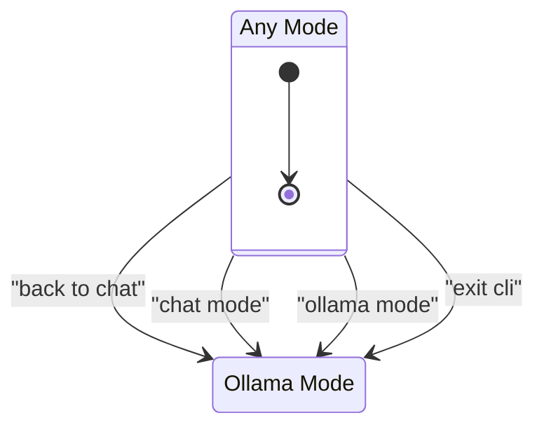
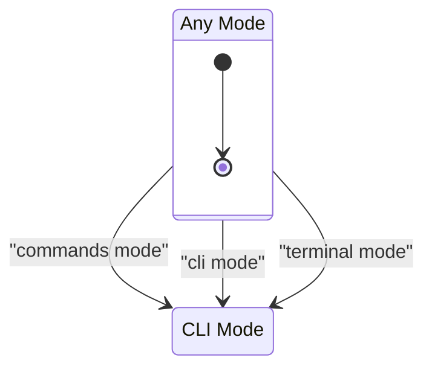
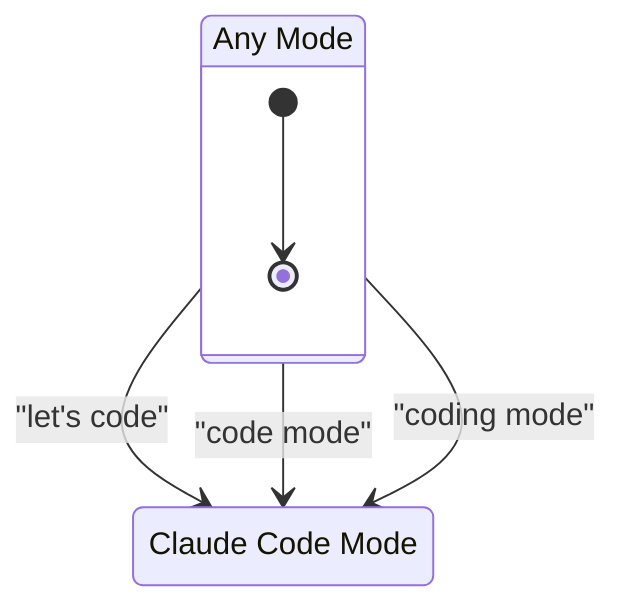
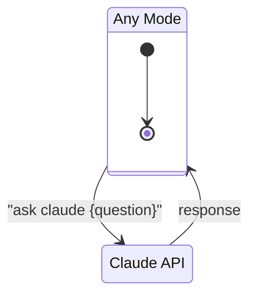

# Cici Modes

## Ollama Mode (Default)

Conversational mode. Input routes to local Ollama (hermes3) for chat responses.
- Maintains conversation context (50 message limit)
- Context preserved when switching modes

## CLI Mode

Command execution mode. Input executes as shell commands via tmux.
- Voice-to-CLI translation for natural commands
- LLM fallback for failed command correction

## Claude Code Mode

Coding assistant mode using Claude Agent SDK. Input routes to Claude Code for:
- Reading/writing/editing files
- Running shell commands
- Searching codebases
- Multi-step coding tasks

### Features
- **Session continuity**: Claude remembers context across exchanges
- **Working directory**: Uses tmux pwd, defaults to cici project dir
- **Brief output**: Responses optimized for voice (1-2 sentences)
- **Confirmations**: Use "affirmative" or "negative" for yes/no prompts

## Claude Queries

Stateless API calls to Claude (claude-sonnet). Works from any mode without changing mode state. Returns response in `llm_response` with `model: "claude-sonnet"`.
